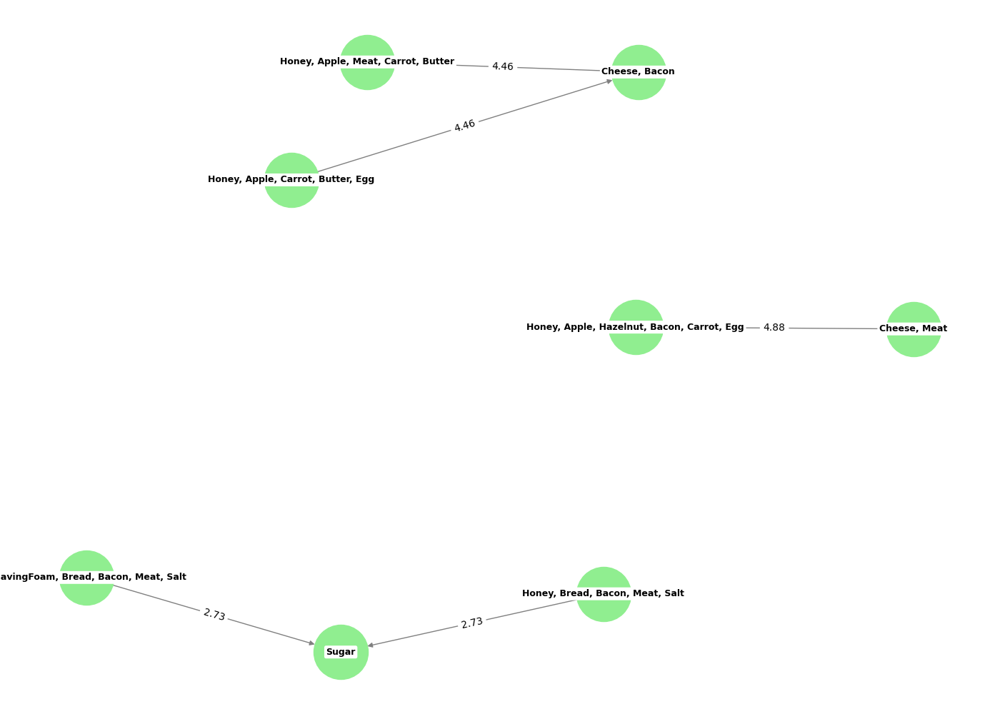

# Frequent Pattern Mining

This project performs association rule mining on a market basket dataset using the Apriori algorithm to discover frequent itemsets and generate association rules. The resulting rules are then visualized as a directed graph.

## How it Works

The script `main.py` performs the following steps:

1.  **Loads Data**: Downloads a market basket dataset from Kaggle using the `kagglehub` library.
2.  **Data Preparation**: The dataset is loaded into a pandas DataFrame and prepared for analysis.
3.  **Frequent Itemset Mining**: The Apriori algorithm from the `mlxtend` library is used to find itemsets that frequently occur together.
4.  **Association Rule Generation**: Based on the frequent itemsets, association rules are generated, indicating the likelihood of items being purchased together.
5.  **Visualization**: The top association rules are visualized as a network graph using `matplotlib` and `networkx`, and the graph is saved as an image.

## Getting Started

### Prerequisites

- [UV](https://docs.astral.sh/uv/getting-started/installation/) for dependency management

### Installation

To run this project, you need to have Python installed. You can then install the necessary dependencies:

```bash
uv sync
```

### Usage

Simply run the `main.py` script:

```bash
uv run main.py
```

The script will download the data, perform the analysis, print the top association rules to the console, and save a visualization of the rules to `association_rules.png`.

## Example Output

Here is an example of the generated association rules graph:



## References

- [Encontre padrões nos seus dados com Apriori e FP-Growth](https://medium.com/@abnersuniga7/encontre-padr%C3%B5es-nos-seus-dados-com-apriori-e-fp-growth-4a581ec1b22)
- [AssociationRuleMining](https://www.kaggle.com/code/devidhan/article-5-associationrulemining)
